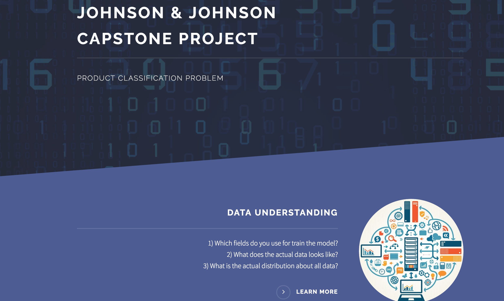
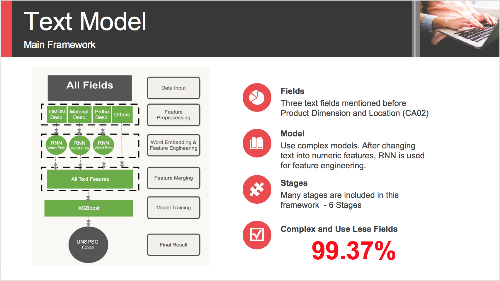

# JJ-Capstone-Project

During this capstone project, we mainly build a recommendation system using machine learning algorithms and an interactive interface to help J&J employees to find most useful information quickly. 

## Part I: Interface 

The interface mainly consists of there parts - Landing Page, Modeling Page and Interface Page. 

- Technology: Python Flask, CSS, Javascript

### 1. Landing Page

Landing Page will direct you to the final page. If you forget something, you can find all related information here.

The final menu to guide users looks like this :

### 2. Modeling Page

Modeling Page provides the final production recommendation using backend machine learning algorithms.

### 3. Interface Page

Interface Page mainly provides quick search function according to J&J's request.

## Part II: Model Building 

### 1. Data Exploration

At first, we check all the features which can be used.

Then, we try to find some patterns within the data.

To test our hypothesis, we check the data distribution and useful features for model building.

### 2. Techniques

To better create features, we use the word embedding technology to transform text into numeric values.

With all these information, we try to use different text fields to train our model.

Below is the final matrix that we use to compare different model performances.

### 3. Main Text Framework
 
Generally speaking, for feature engineering, RNN has been used to deal with descriptions about the product. We use this way for feature engineering. After this stage, we combine all data together and use boosting tree to build final model.

- Tools: RNN with GRU and XGboost 
- Problems: Overfitting 

However, the accuracy is really very high. This is caused by many reasons - Target Variable Distribution... 

